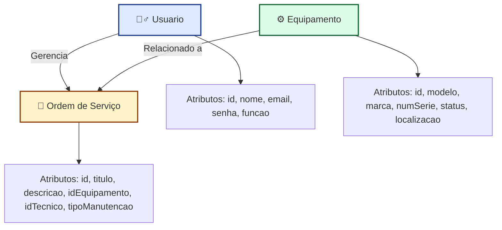

🧰 Sistema de Gestão de Manutenção (SGM)

📁 Projeto Formativo - DevSolutions

📘 Briefing do Projeto
🔍 Visão Geral

O projeto consiste no desenvolvimento de um Sistema de Gestão de Manutenção (SGM), voltado para controle e otimização de processos de manutenção em uma aplicação web moderna.

🧭 Escopo do Projeto
🎯 Objetivos

Gerenciar ordens de serviço e equipamentos.

Otimizar o fluxo de manutenção.

Centralizar informações em um sistema único e acessível.

Garantir segurança e autenticação confiável dos usuários.

👥 Público-Alvo

Técnicos de Manutenção — executam e registram ordens de serviço.

Gestores de Manutenção — acompanham atividades e gerenciam equipamentos.

Administradores — gerenciam usuários e têm acesso total ao sistema.

💻 Tecnologias Utilizadas

Next.js (frontend e backend com App Router)

Node.js

MongoDB + Mongoose

JWT + Bcrypt (autenticação e segurança)

SCSS (estilização de componentes)

🧩 Modelagem e Diagramas
Diagrama de “Classes” 


🎭 Diagrama de Casos de Uso
```mermaid
graph TD
    subgraph "SGM"
        caso1([Fazer Login])
        caso2([Gerenciar Ordens de Serviço - CRUD])
        caso3([Gerenciar Equipamentos - CRUD])
        caso4([Gerenciar Usuários - CRUD])
        caso5([Acessar o Dashboard])

    Tecnico([👨‍🔧 Técnico])
    Gestor([👨‍💼 Gestor])
    Admin([👑 Administrador])

    Tecnico --> caso1
    Tecnico --> caso2
    Tecnico --> caso5

    Gestor --> caso1
    Gestor --> caso2
    Gestor --> caso3
    Gestor --> caso5

    Admin --> caso1
    Admin --> caso4
    Admin --> caso5
```

🔄 Diagrama de Fluxo – Login e Dashboard
graph TD
    A[🏁 Início] --> B[Acessa Tela de Login]
    B --> C[Preenche Email e Senha]
    C --> D{Credenciais válidas?}
    D -->|Sim| E[Gera Token JWT]
    E --> F[Redireciona para o Dashboard]
    D -->|Não| G[Exibe mensagem de erro]
    G --> B
```

📘 Explicação:

Usuário faz login → sistema valida → gera token JWT → acessa painel principal.

Em caso de erro, retorna à tela de login.

⚠️ Análise de Risco
🔧 Riscos Técnicos
ID	Risco	Probabilidade	Impacto	Mitigação
1	Chave JWT comprometida	Média	Alto	Usar chaves seguras e armazenar em variáveis de ambiente.
2	Vulnerabilidade do Bcrypt	Baixa	Alto	Garantir tamanho adequado e isolamento da senha.
3	Lentidão com grandes volumes	Média	Média	Indexar consultas e aplicar paginação.
4	Bugs e baixa qualidade de código	Alta	Média	Realizar revisões e testes automatizados.
🗂️ Riscos de Gerenciamento
ID	Risco	Probabilidade	Impacto	Mitigação
5	Aumento de escopo (scope creep)	Alta	Média	Controlar mudanças e validar impacto antes da aprovação.
6	Atrasos na entrega	Alta	Média	Aplicar metodologias ágeis e revisar cronogramas por sprint.
7	Requisitos mal interpretados	Média	Alto	Validar protótipos e manter contato com o cliente.
🏢 Riscos Organizacionais
ID	Risco	Probabilidade	Impacto	Mitigação
8	Resistência dos usuários	Média	Alto	Envolver equipe desde o início e comunicar benefícios.
9	Dados incorretos no sistema	Média	Alto	Implementar validações e revisar importações.
10	Falta de treinamento	Média	Média	Criar manuais e treinamentos práticos.#
